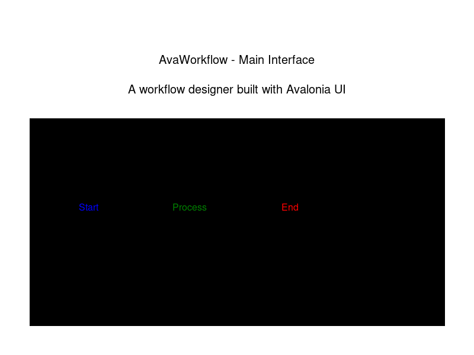
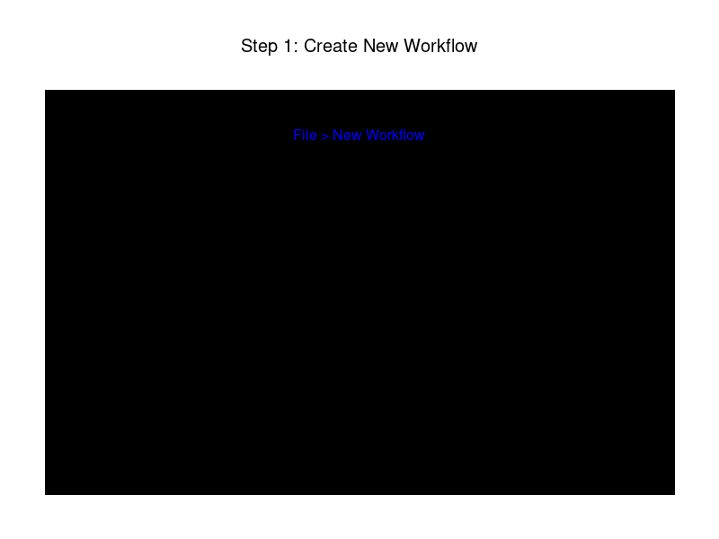
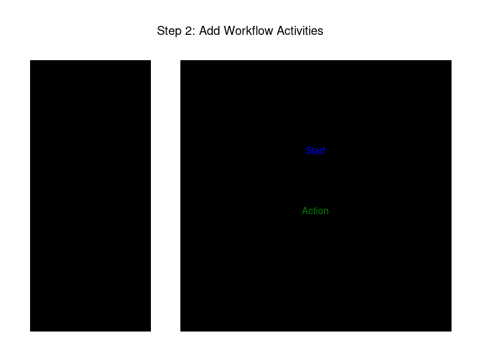
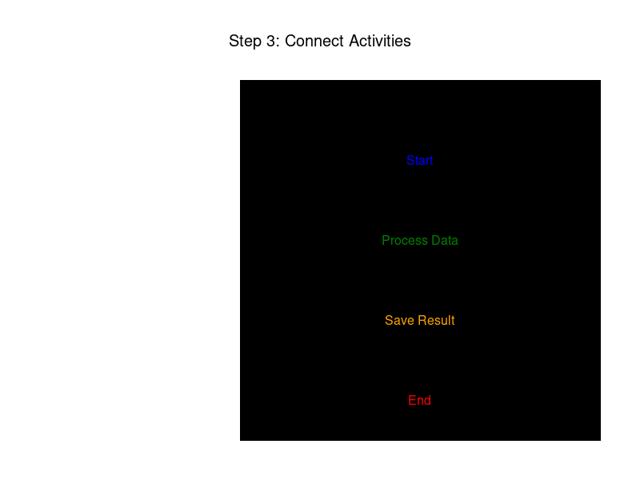
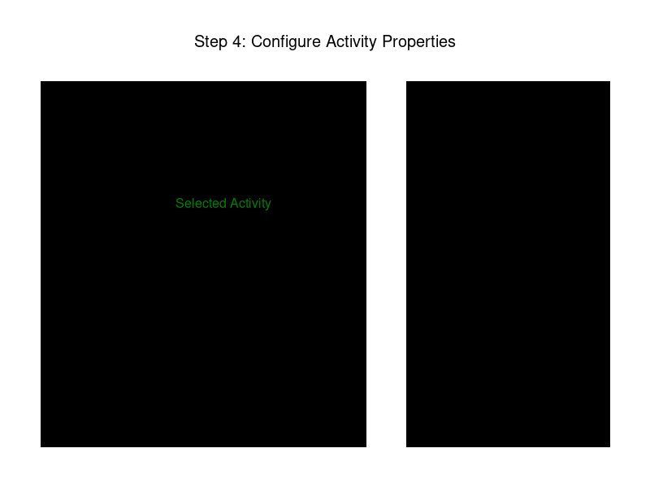
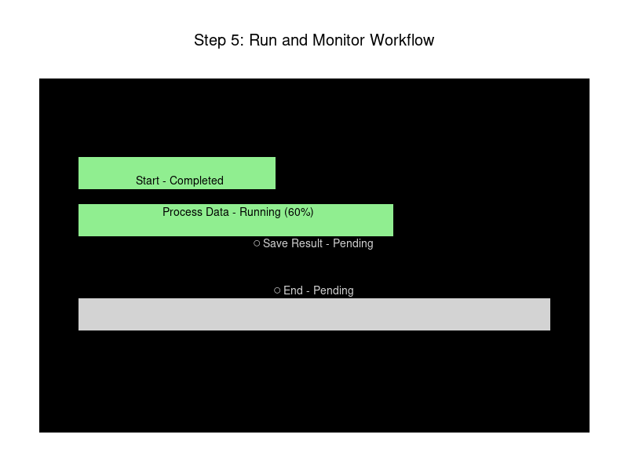
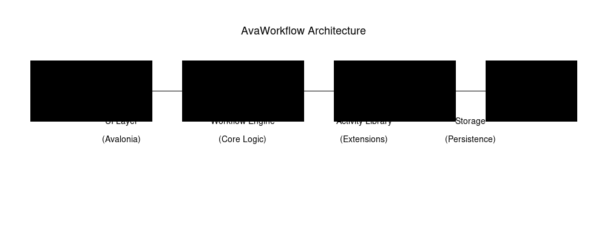

# AvaWorkflow

**AvaWorkflow** is a powerful, cross-platform workflow designer and execution engine built with [Avalonia UI](https://avaloniaui.net/). It provides an intuitive visual interface for creating, editing, and executing workflows across Windows, macOS, and Linux.



## 📋 Table of Contents

- [Features](#features)
- [Prerequisites](#prerequisites)
- [Installation](#installation)
- [Getting Started Tutorial](#getting-started-tutorial)
  - [Step 1: Create a New Workflow](#step-1-create-a-new-workflow)
  - [Step 2: Add Workflow Activities](#step-2-add-workflow-activities)
  - [Step 3: Connect Activities](#step-3-connect-activities)
  - [Step 4: Configure Activity Properties](#step-4-configure-activity-properties)
  - [Step 5: Run and Monitor Workflow](#step-5-run-and-monitor-workflow)
- [Architecture](#architecture)
- [Building from Source](#building-from-source)
- [Contributing](#contributing)
- [License](#license)

## ✨ Features

- **Cross-Platform**: Runs on Windows, macOS, and Linux thanks to Avalonia UI
- **Visual Workflow Designer**: Drag-and-drop interface for creating workflows
- **Extensible Activity Library**: Built-in activities with support for custom extensions
- **Real-time Execution Monitoring**: Track workflow execution with live status updates
- **Persistent Storage**: Save and load workflows for reuse
- **MVVM Architecture**: Clean separation of concerns using Model-View-ViewModel pattern
- **Modern UI**: Beautiful, responsive interface built with Avalonia

## 📦 Prerequisites

Before you begin, ensure you have the following installed:

- [.NET 8.0 SDK](https://dotnet.microsoft.com/download) or later
- An IDE of your choice:
  - [Visual Studio 2022](https://visualstudio.microsoft.com/) (Windows/Mac)
  - [JetBrains Rider](https://www.jetbrains.com/rider/)
  - [Visual Studio Code](https://code.visualstudio.com/) with C# extension

## 🚀 Installation

### From Release

Download the latest release for your platform from the [Releases](https://github.com/JimmyKodu/AvaWorkflow/releases) page.

### From Source

```bash
# Clone the repository
git clone https://github.com/JimmyKodu/AvaWorkflow.git
cd AvaWorkflow

# Restore dependencies
dotnet restore

# Build the project
dotnet build

# Run the application
dotnet run --project AvaWorkflow
```

## 📖 Getting Started Tutorial

This tutorial will guide you through creating your first workflow in AvaWorkflow.

### Step 1: Create a New Workflow

1. Launch AvaWorkflow
2. Click **File** → **New Workflow** or press `Ctrl+N` (Windows/Linux) / `Cmd+N` (Mac)
3. Enter a name for your workflow
4. Select a workflow template (or start with a blank workflow)
5. Click **Create**



### Step 2: Add Workflow Activities

The **Activity Toolbox** on the left contains all available activities. To add activities to your workflow:

1. Browse the available activities in the toolbox
2. Drag an activity from the toolbox to the canvas
3. Drop it where you want it to appear

**Common Activities:**
- **Start Activity**: Entry point of your workflow
- **Decision**: Conditional branching based on expressions
- **Loop**: Repeat activities multiple times
- **Custom Action**: Execute custom code or scripts
- **End Activity**: Terminal point of your workflow



### Step 3: Connect Activities

Connect activities to define the execution flow:

1. Click on the output connector (right side) of an activity
2. Drag to the input connector (left side) of another activity
3. Release to create the connection

The workflow engine will execute activities following these connections.



**Tips:**
- Activities can have multiple input/output connections
- Use Decision activities to create conditional branches
- Loops allow you to iterate over collections or repeat actions

### Step 4: Configure Activity Properties

Each activity has configurable properties:

1. Select an activity by clicking on it
2. The **Properties Panel** will appear on the right
3. Configure the activity's settings:
   - **Name**: Unique identifier for the activity
   - **Type**: Activity type (read-only)
   - **Timeout**: Maximum execution time
   - **Retry**: Number of retry attempts on failure
   - **Input/Output**: Data bindings and expressions



**Variable Syntax:**
- Use `${variableName}` to reference variables
- Variables can be set by previous activities
- Use expressions for dynamic values

### Step 5: Run and Monitor Workflow

Execute and monitor your workflow:

1. Click the **Run** button (▶️) in the toolbar or press `F5`
2. The **Execution Monitor** shows real-time status:
   - ✓ **Completed**: Activity finished successfully
   - ⟳ **Running**: Activity is currently executing
   - ○ **Pending**: Activity is waiting to execute
   - ✗ **Failed**: Activity encountered an error



**Additional Features:**
- **Pause**: Temporarily halt execution (⏸️)
- **Stop**: Terminate the workflow (⏹️)
- **Step Through**: Execute one activity at a time for debugging
- **View Logs**: Access detailed execution logs

## 🏗️ Architecture

AvaWorkflow is built with a modular, layered architecture:



### Components

1. **UI Layer (Avalonia)**
   - Visual workflow designer
   - Property editors
   - Execution monitor
   - Built with MVVM pattern

2. **Workflow Engine (Core Logic)**
   - Workflow execution
   - Activity scheduling
   - State management
   - Error handling and retry logic

3. **Activity Library (Extensions)**
   - Built-in activities
   - Custom activity support
   - Activity metadata and validation

4. **Storage (Persistence)**
   - Workflow serialization/deserialization
   - Support for multiple formats (JSON, XML)
   - Version control friendly

## 🔨 Building from Source

### Requirements
- .NET 8.0 SDK or later
- Git

### Build Steps

```bash
# Clone the repository
git clone https://github.com/JimmyKodu/AvaWorkflow.git
cd AvaWorkflow

# Restore NuGet packages
dotnet restore

# Build the solution
dotnet build --configuration Release

# Run tests
dotnet test

# Run the application
dotnet run --project AvaWorkflow
```

### Project Structure

```
AvaWorkflow/
├── AvaWorkflow/              # Main application project
│   ├── Views/                # Avalonia views
│   ├── ViewModels/           # View models
│   ├── Models/               # Data models
│   └── Services/             # Application services
├── AvaWorkflow.Core/         # Workflow engine
│   ├── Activities/           # Activity definitions
│   ├── Engine/               # Execution engine
│   └── Serialization/        # Workflow persistence
├── AvaWorkflow.Activities/   # Activity library
└── AvaWorkflow.Tests/        # Unit tests
```

## 🤝 Contributing

Contributions are welcome! Here's how you can help:

1. Fork the repository
2. Create a feature branch (`git checkout -b feature/amazing-feature`)
3. Commit your changes (`git commit -m 'Add amazing feature'`)
4. Push to the branch (`git push origin feature/amazing-feature`)
5. Open a Pull Request

Please read our [Contributing Guidelines](CONTRIBUTING.md) for more details.

## 📄 License

This project is licensed under the MIT License - see the [LICENSE](LICENSE) file for details.

## 🙏 Acknowledgments

- [Avalonia UI](https://avaloniaui.net/) - The cross-platform UI framework
- All contributors who have helped this project

## 📞 Support

- **Issues**: [GitHub Issues](https://github.com/JimmyKodu/AvaWorkflow/issues)
- **Discussions**: [GitHub Discussions](https://github.com/JimmyKodu/AvaWorkflow/discussions)
- **Documentation**: [Wiki](https://github.com/JimmyKodu/AvaWorkflow/wiki)

---

Made with ❤️ using [Avalonia UI](https://avaloniaui.net/)